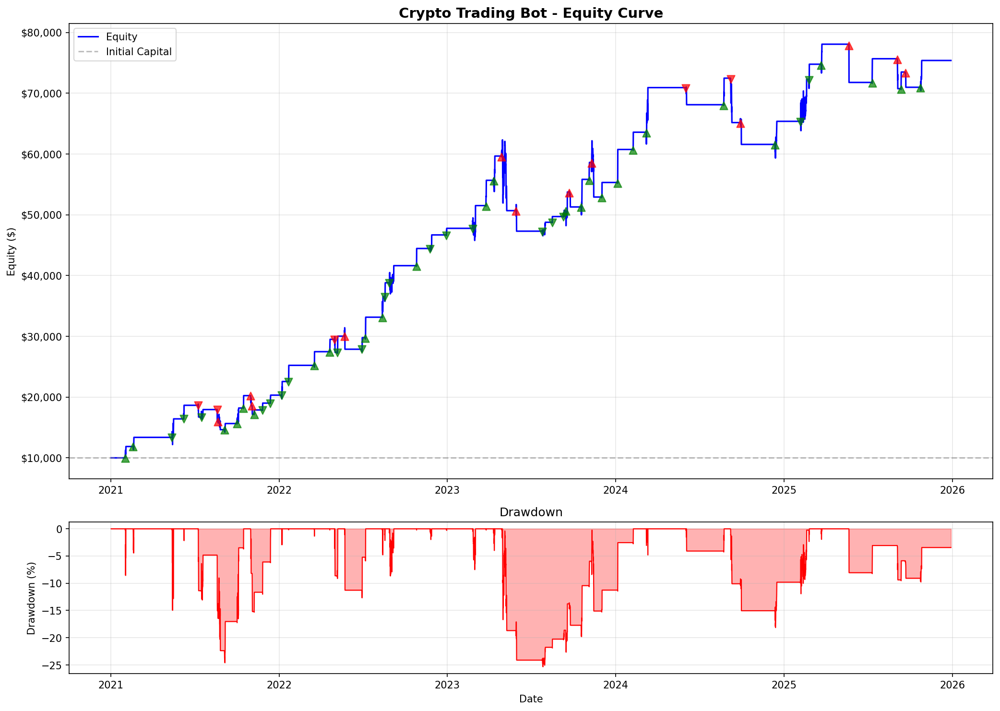
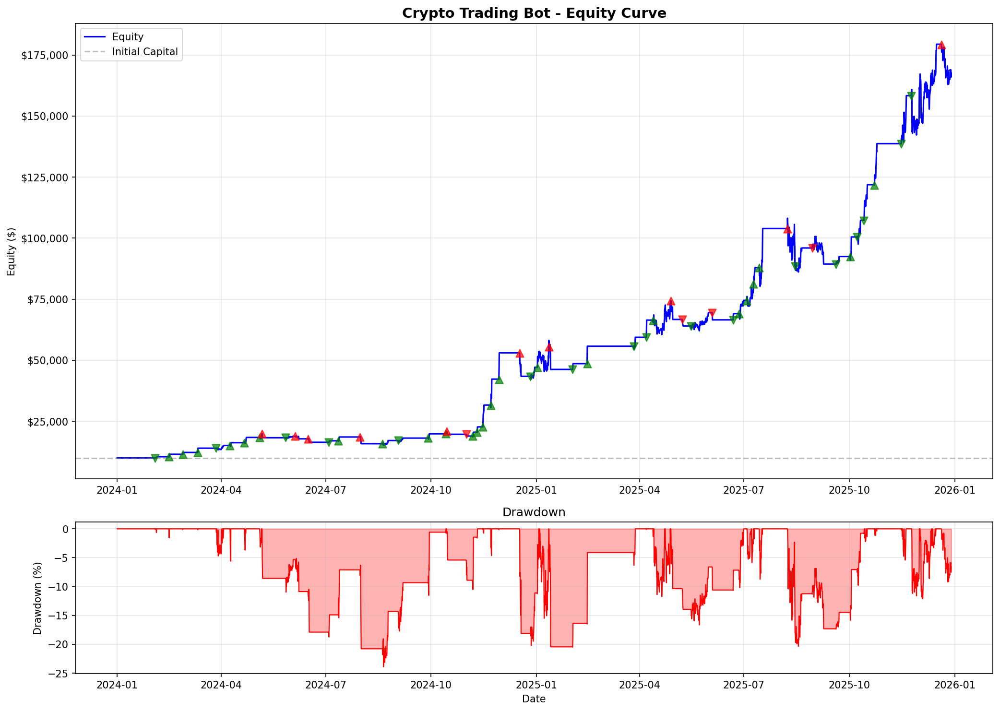
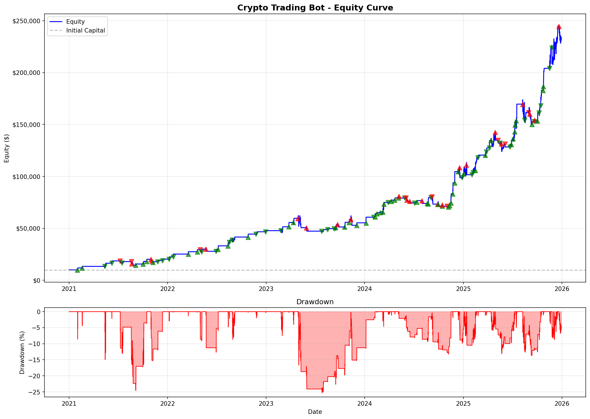

# keltrader

A Bollinger Band Squeeze momentum trading system for crypto — supports backtesting, parameter optimization, and live trading on Coinbase.

## Strategy

The core signal is a **BB Squeeze breakout**:

1. Bollinger Bands contract inside Keltner Channels (squeeze = compression)
2. Momentum starts to accelerate as the squeeze releases
3. Volume confirms the breakout direction
4. RSI filters out entries at extremes (overbought/oversold)
5. ATR-based stop loss and take profit targets are set on entry

Each asset has individually optimized parameters for BB period/std, KC period/ATR multiplier, RSI thresholds, squeeze bar count, volume ratio, and ATR stop/target multipliers.

## Project Structure

```
keltrader/
├── technical.py          # BB, Keltner Channel, squeeze detection, RSI, volume
├── signal_generator.py   # Entry/exit signal logic
├── backtester.py         # Event-driven backtester (spot and leveraged futures)
├── optimizer.py          # Single-asset Optuna optimizer with walk-forward CV
├── optimize_lib.py       # Shared optimizer utilities, walk-forward split logic
├── permutation_test.py   # Statistical significance testing via permutation
├── data_utils.py         # Multi-timeframe OHLCV data loading and caching
├── download_data.py      # Alpaca data downloader
├── coinbase_live_trader.py  # Live trading engine (Coinbase Advanced Trade API)
├── run_backtest.py       # Backtest runner — single or multi-asset
├── run_live_multi_asset.py  # Live trading runner — multi-asset
├── check_trade.py        # Inspect open/closed positions on Coinbase
├── debug_trade.py        # Debug signal and order flow
├── debug_coinbase_pnl.py # Reconcile Coinbase P&L vs internal trade journal
└── utils.py              # Shared utilities (colors, formatting)
```

## Backtesting

```bash
# Single asset, spot mode
python run_backtest.py --symbols BTC/USD

# Multiple assets
python run_backtest.py --symbols BTC/USD,XRP/USD

# With leverage (futures mode)
python run_backtest.py --symbols BTC/USD,XRP/USD --leverage

# Custom maintenance margin
python run_backtest.py --leverage --maintenance-margin 0.3
```

Backtests run per-asset with separate capital pools and produce a combined equity curve and drawdown chart when multiple assets are specified.

## Optimization

```bash
python optimizer.py --symbol BTC/USD --sampler tpe --trials 200
python optimizer.py --symbol XRP/USD --sampler random --trials 500
```

The optimizer uses walk-forward cross-validation with anti-overfitting scoring:
- Bell curve penalties on win rate and profit factor to discourage curve-fitting
- tanh-saturated Sharpe reward (diminishing returns above 1.5)
- Neighborhood stability penalty (perturbs params ±10%, penalizes narrow peaks)
- Fold aggregation: `mean - 0.5 * std` to penalize high fold variance

## Live Trading

Requires Coinbase Advanced Trade API credentials set as environment variables:

```bash
export COINBASE_API_KEY="your_key"
export COINBASE_API_SECRET="your_secret"
```

```bash
python run_live_multi_asset.py
```

The live trader syncs position state from Coinbase on startup, tracks P&L and drawdown, detects drift vs backtest performance, and sends Telegram notifications.

## Setup

```bash
pip install -r requirements.txt
```

Data is fetched via the [Alpaca Markets](https://alpaca.markets) crypto data API. Set your Alpaca credentials:

```bash
export ALPACA_API_KEY="your_key"
export ALPACA_SECRET_KEY="your_secret"
```

## Results

### BTC/USD — Leveraged



### XRP/USD — Leveraged



### BTC/USD + XRP/USD — Leveraged (Combined)



## Disclaimer

This software is for educational purposes only. Cryptocurrency trading involves substantial risk of loss. The authors are not responsible for any financial losses incurred through the use of this software.

## License

MIT — see [LICENSE](LICENSE)
